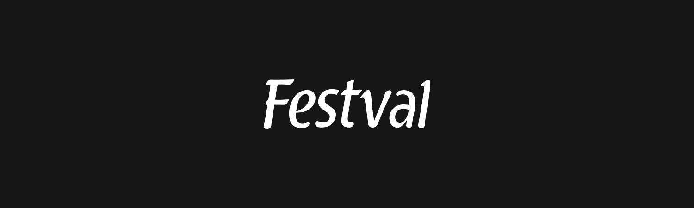

## Super Festval - Setor de desenvolvimento

### Um Pouco sobre a empresa 😀

O Festval é uma rede de supermercados que, no total, possui 22 lojas, sendo 5 em Cascavel e 17 em Curitiba e Pinhais. Todas as lojas são padronizadas, seguindo uma arquitetura moderna e acessível. A rede também oferece marcas e linhas de produtos especiais, como a Mamma Bia, que se concentra em artigos tradicionalmente italianos, a linha Natural Festval, que se concentra em alimentos naturais e sem conservantes, e a linha dia a dia, que inclui produtos para consumo diário. Além disso, possui sua própria rede de importação, com uma lista de mais de 1.000 itens de diversos países, facilitando o acesso do consumidor a produtos importados de qualidade. Com inovação e responsabilidade, a Rede Festval trabalha para oferecer ambientes e momentos agradáveis aos seus clientes, com diferenciais que tornam o atendimento em suas lojas mais humano, personalizado e exclusivo.

### Fale com a gente 🚀

[Festval.com](https://festval.com) | [Instagram](https://www.instagram.com/festvalcuritiba/) | [Twitter](https://twitter.com/festvalcuritiba)
